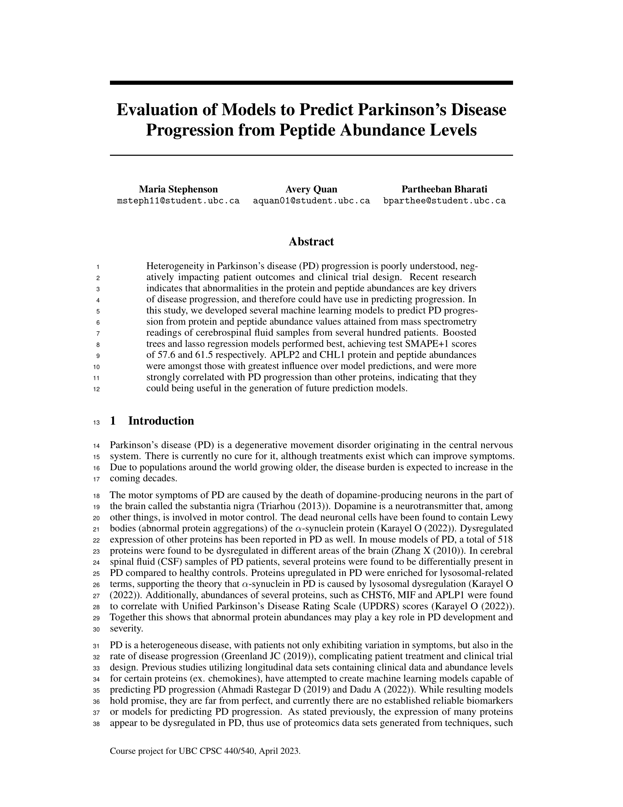
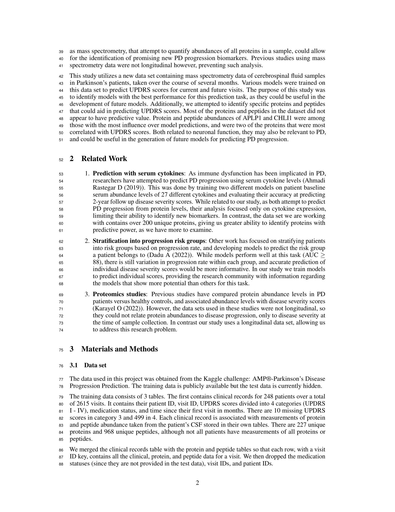
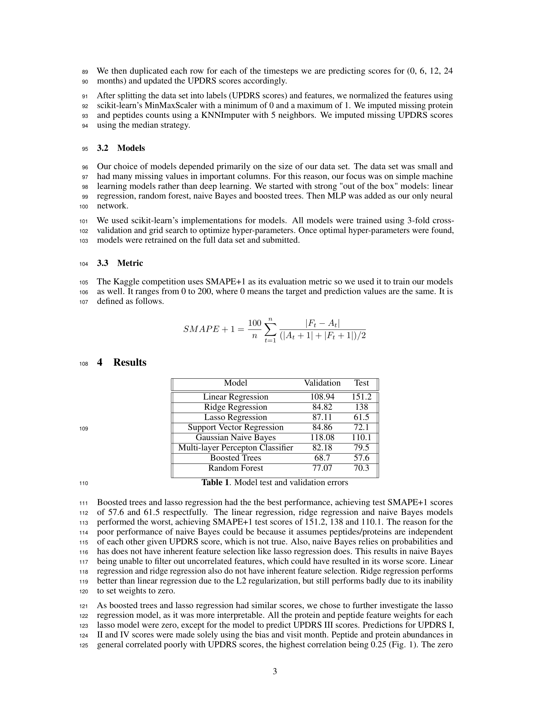
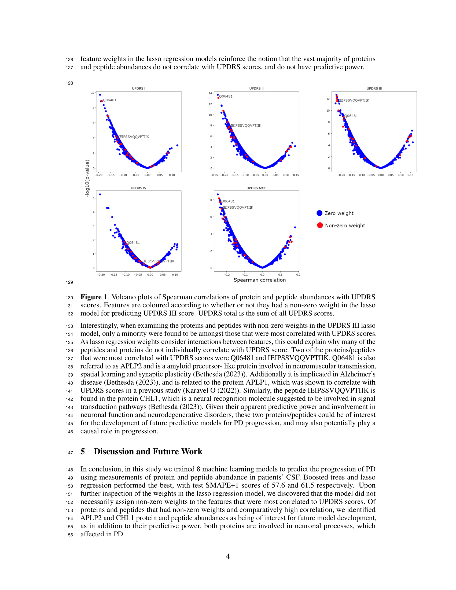
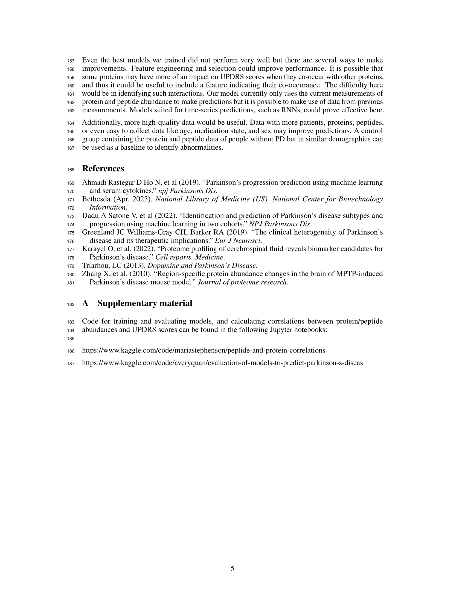

# CPSC440Project
Code can be found at: 
https://www.kaggle.com/code/mariastephenson/peptide-and-protein-correlations 
https://www.kaggle.com/code/averyquan/evaluation-of-models-to-predict-parkinson-s-diseas 

